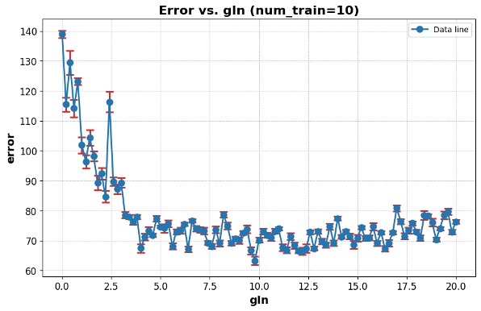
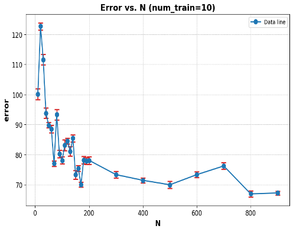

> Many thanks to my lovely group members! ----- Meowdel, Vital - Aster Group 1 

**Working memory** (WM) is a form of short-term memory which allows for temporary storage and manipulation of information for cognitive processing. Its mechanism is proposed to come from the persistent neural firing within its network. Such networks hence connect sensory and motor regions and are capable of maintaining representations of past inputs for later use. For a finite number of neurons and a finite number of representations there are theoretical limitations of information that can be encoded within the network. 
However, the amount of information encoded also depended on the network structure. Computational models could be used to investigate the WM network capacity, among which **Recurrent Neural Networks** (RNNs) show significant capability in producing firing rates fluctuations for a longer magnitude on timescales than that of the membrane time constant of individual neurons. Thus, we developed a RNN-based WM model with parameters *simulating biological factors* contributing to working memory, e.g. synaptic strength, connection sparsity, and number of neurons. 

  

|Variable|Representation|
|:---:|:---:|
|`N`|Number of neurons in *recurrent pool* (default=1000)|
|`g`|Gain of synaptic weights in *recurrent pool* (default=0.95)|
|`gIn`|Gain of synaptic weights in *input layer* (default=10)|
|`sp`|Connection sparsity of neurons in *recurrent pool* (default=0.25)|
|`spIn`|Connection sparsity of neurons in *input layer* (default=0.05)|
|`X`|Time lag in task of *decoder*|

We built a decoder (a neural network with 2 hidden layers) to decode firing rates into the original WM-model input. The capacity of the WM-model is determined by the performance of the decoder, which was denoted by the **correlation** between real and decoded input. 

We investigated the effects of each parameter as well as its interactions on the WM capacity, then also optimized the WM model for its maximal performance. For each parameter, the change of performance of the decoder while increasing its value and keeping others fixed indicates its role in forming WM of RNN. These findings encourage better understanding of human’s brain.

  

  

As a results, in a limited range of values, there are relatively significantly positive correlations between the number of neurons (`N`), the gain of the input layer (`gIn`), and the WM capacity of RNN, while the gain of recurrent layer (`g`) and sparsity in both two layers (`sp` & `spIn`) have no significant correlation with WM capacity.

[Example Code (Colab)](https://drive.google.com/file/d/1SSVCdSo_x2_bkMs493W0wSXFWl49VYjP/view?usp=sharing)

<!--more-->
